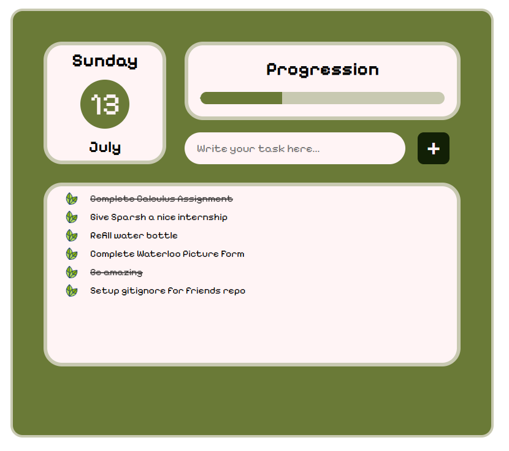

# React + Vite
Found some random inspiration on instagram and decided to recreate it using reactJS

Click on task to complete
> Access the project [here](https://opseclipse.github.io/To-do-react/)
> 
> 

https://roadmap.sh/projects/task-tracker-js
